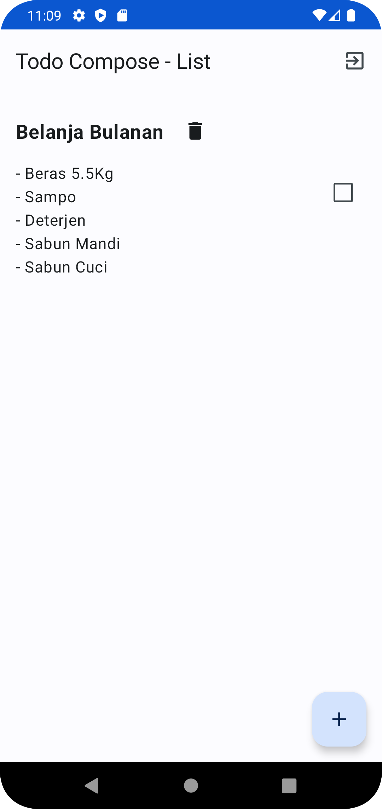
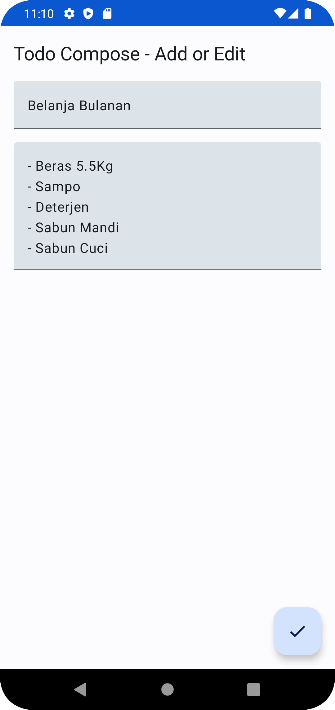
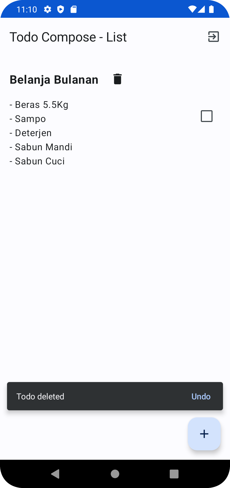

# Todo Android Compose
Todo Android App with Compose

## Requirements
- JDK 11
- Android Studio Dolphin + SDK
- Gradle 7.4
- Git

## Screenshots
| TodoList                                         | TodoAddEdit                                            | TodoDelete                                           |
|--------------------------------------------------|--------------------------------------------------------|------------------------------------------------------|
|  |  |  |

## How to Run This Project
todo

## Architecture
todo

## MAD Score
todo

## Todo

- [x] Todo List
- [x] Todo Add or Edit
- [x] Using Local Data
- [x] Migrate to gradle version catalog
- [ ] Add User Register and Login
- [ ] Store to Cloud (e.g. Firebase Firestore)
- [ ] Support Multiple Device
- [ ] Add Unit Test
- [ ] Add UI Test
- [ ] Add CI/CD
- [ ] UI Improvement

